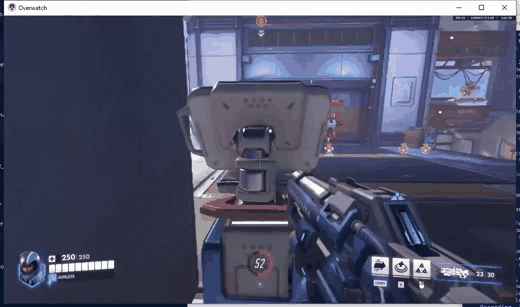

# fastpaced-intelligence

## Why this exists

The long-term goal is a generalist robotic model that can think *and* take continuous, fast-paced action. Today's architectures don't support that. LLMs reason but don't act in real time. VLAs act but don't reason deeply. We want both at once.

Games are a good training ground for this. But the game has to be the right kind. Turn-based games are already in LLM territory, so they don't push the architecture forward. We need something **multiplayer and fast-paced**, where thinking and acting happen at the same time.

## Why Overwatch

Overwatch isn't just a shooter. It has many heroes, each with their own playstyle, abilities, and decision space. Training across all of them forces a model toward general intelligence rather than a single narrow skill.

## Why Overwatch replays

Overwatch replays restore the full match from any of the 10 players' perspectives. A single replay code is enough to reconstruct every player's POV with their exact inputs — the ones they actually made, not estimates. So one ~10-minute match yields ~100 minutes of high-quality, accurately annotated POV video, all from one code.

## First step

A pipeline that takes a public Overwatch replay code and turns it into 10 annotated videos — one per-player POV with the inputs that produced it.

See [nitrogen/RUN.md](nitrogen/RUN.md) for setup and run instructions.
